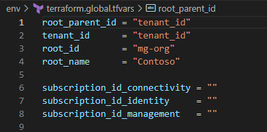
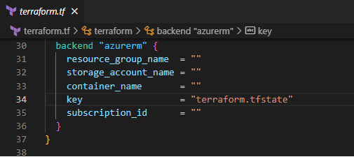

## Getting Started with a Customer Deployment

Please follow these instructions to copy/clone this repository to a customer site.

1. Download this artefact/repository as a ZIP archive
1. Open and export the ZIP archive to local disk.
1. Delete the entire folders:
   - `.local`, and
   - `.git` (this is a hidden folder in the root `/`).
1. Delete the file  `[User-Guide]-Getting-Started-with-Customer-deployment.md`
1. Upload this modified artefact to the customer site.

### Update CODEOWNERS

You have to update/add your name or teams in the CODEOWNER file in the .github/ directory.

A CODEOWNERS file uses a pattern that follows most of the same rules used in gitignore files. The pattern is followed by one or more  usernames or team names using the standard @username or @org/team-name format. Users and teams must have explicit write access to the repository, even if the team's members already have access.

### Assign Insight Partner ID to Azure services

Please refer the Insight internal repository [azure-pal](https://github.com/Insight-Services-APAC/azure-pal) to know more about how to assign the Insight Partner ID to Azure services.

### Update values of Input Variables

Update values of variables as per the customer requirements in the tfvar files under env\ directory. There are multiple tfvars files - one global tfvars file and each tfvars file for each module like connectivity, identity, management etc.

For example, the details like tenant id, root id, root name, subscription ids etc. should be updated in terraform.global.tfvars file.



### Customisation of Modules

If you would like to set the custom configurations for each module, this can be done by setting the proper variables. The following variables are important, but please keep in mind that this is not a comprehensive list. Additional variables may be required depending on the specific needs of your project. The complete list of variables are available [here](https://registry.terraform.io/modules/Azure/caf-enterprise-scale/azurerm/latest#required-inputs) to set the required customisation.

#### archetype_config_overrides in terraform.global.tfvars file
This will set custom Archetype configurations for the core ALZ Management Groups, but it does not work for management groups specified by the 'custom_landing_zones' input variable. To override the default configuration settings for any of the core Management Groups, add an entry to the archetype_config_overrides variable for each Management Group you want to customize. Refer this [official documentation](https://registry.terraform.io/modules/Azure/caf-enterprise-scale/azurerm/latest#a-nameinput_archetype_config_overridesa-archetype_config_overridesinput_archetype_config_overrides)for more details.

#### configure_connectivity_resources in terraform.connectivity.tfvars
If specified, will customize the \"Connectivity\" landing zone settings and resources. Refer this [official documentation](https://registry.terraform.io/modules/Azure/caf-enterprise-scale/azurerm/latest#a-nameinput_configure_connectivity_resourcesa-configure_connectivity_resourcesinput_configure_connectivity_resources) for more details.

#### configure_identity_resources in terraform.identity.tfvars
If specified, will customize the \"Identity\" landing zone settings and resources. Refer this [official documentation](https://registry.terraform.io/modules/Azure/caf-enterprise-scale/azurerm/latest#a-nameinput_configure_identity_resourcesa-configure_identity_resourcesinput_configure_identity_resources) for more details.

#### configure_management_resources in terraform.management.tfvars
If specified, will customize the \"Management\" landing zone settings and resources. Refer this [official documentation](https://registry.terraform.io/modules/Azure/caf-enterprise-scale/azurerm/latest#a-nameinput_configure_management_resourcesa-configure_management_resourcesinput_configure_management_resources) for more details.

### Advanced Customisation

The variable "custom_settings_by_resource_type" allows full customization of common settings for all resources (by type) deployed by corresponding module.

For example, the resource group names can be modified in the connectivity modules by following the below section.

#### Update Resource group Naming convention

Update the variable 'configure_connectivity_resources' in the file env/terraform.connectivity.tfvars

```terraform
configure_connectivity_resources = {
    advanced = {
      custom_settings_by_resource_type = {
        azurerm_resource_group = {
          connectivity = {
            westeurope = { # replace with the location you're using
              name = "rg-test-connectivity"  # replace with the cutsom resource group name you're using
            }
          },
          dns = {
            westeurope = { # replace with the location you're using
              name = "rg-test-dns"  # replace with the cutsom resource group name you're using
            }
          }
         }
      }
   }
}
```

#### Update Virtual network gateway names for VPN and Express Route

```terraform
configure_connectivity_resources = {
    advanced = {
      custom_settings_by_resource_type = {
         azurerm_virtual_network_gateway = {
            connectivity_expressroute = {
               australiaeast = {  # replace with the location you're using
                  name = "ergw-hub-test-01"  # replace with the cutsom name you're using
               }
            }
            connectivity_vpn = {
               australiaeast = {  # replace with the location you're using
                  name = "vpngw-hub-test-01"   # replace with the cutsom name you're using
               }
            }
         }
      }
   }
}
```
### Update Terraform remote state details

Update terraform.tf file with the details of remote tfstate file.



### Execute using DevOps Pipelines

You can either execute the code using the [Azure Devops Pipelines](/.ado/pipelines) or [GitHub workflows](/.github/workflows) provided in this repository.
